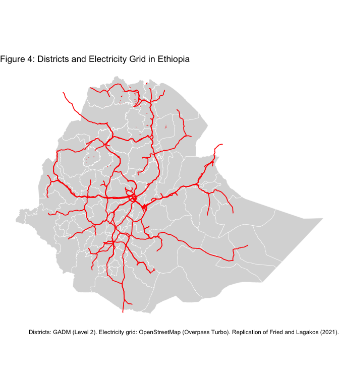
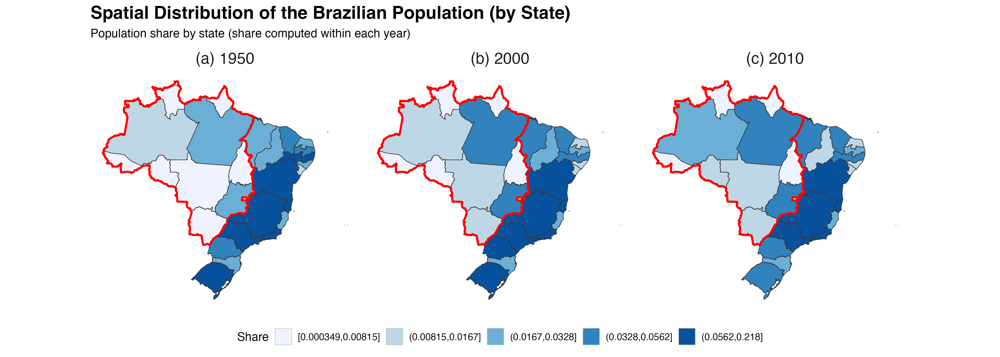
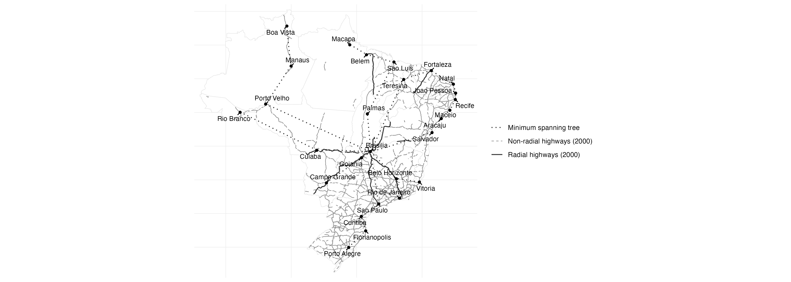

```{r setup, include=FALSE}
knitr::opts_chunk$set(echo = TRUE, eval = FALSE)
```

# 1. Mettetal, E., 2019. Irrigation dams, water and infant mortality: Evidence from South Africa (fig. 2: hydro dams in South Africa)

Original File: `Figure_1/Figure1_olta.rmd`

```{r, eval=FALSE}
# Load packages used in class for vector and raster spatial analysis
# sf: vector data (districts, dams)
# terra: raster data (elevation)
# tidyverse: data handling and plotting
library(sf)
library(terra)
library(tidyverse)
```

### Load data
```{r, eval=FALSE}
# ------------------------------------------------------
# Load spatial data
# ------------------------------------------------------

# Administrative districts of South Africa (level 2)
# These units match the spatial aggregation used in the paper
sa_districts <- st_read("boundaries/gadm41_ZAF_2.shp")

# Global Reservoir and Dam (GRanD) database
# Provides point locations of large dams worldwide
dams <- st_read("dams/GRanD_dams_v1_3.shp")

# Elevation raster (SRTM-based)
# Used as a proxy for river gradient at the district level
elev <- rast("elevation/wc2.1_30s_elev.tif")
```

### Filter dams
```{r, eval=FALSE}
# ------------------------------------------------------
# Restrict dams to South Africa
# ------------------------------------------------------

# Spatial intersection keeps only dam points located
# within South African district boundaries
dams_sa <- dams[sa_districts, ]
```

### CRS harmonisation
```{r, eval=FALSE}
# ------------------------------------------------------
# Harmonise coordinate reference systems
# ------------------------------------------------------

# All spatial objects are transformed to WGS84 (EPSG:4326).
# Although the original datasets already use this CRS,
# this step ensures consistency and mirrors the class workflow.
sa_districts <- st_transform(sa_districts, 4326)
dams_sa <- st_transform(dams_sa, 4326)
elev <- project(elev, "EPSG:4326")
```

### Crop and mask raster
```{r, eval=FALSE}
# ------------------------------------------------------
# Crop elevation raster to South Africa
# ------------------------------------------------------

# Convert district polygons to terra vector format
sa_vect <- vect(sa_districts)

# Crop and mask reduce the raster to the study area,
# improving performance and ensuring correct aggregation
elev_sa <- crop(elev, sa_vect)
elev_sa <- mask(elev_sa, sa_vect)
```

### Aggregate elevation (this is key)
```{r, eval=FALSE}
# ------------------------------------------------------
# Aggregate elevation by district
# ------------------------------------------------------

# Mean elevation is computed for each district polygon
# This serves as a proxy for average river gradient,
# which is not directly available at the district level
elev_mean <- terra::extract(
  elev_sa,
  sa_vect,
  fun = mean,
  na.rm = TRUE
)

# Attach aggregated values to district data
sa_districts$mean_elev <- elev_mean[, 2]
```


### Create classes
```{r, eval=FALSE}
# ------------------------------------------------------
# Create discrete elevation classes
# ------------------------------------------------------

# Quantile-based bins are used to reproduce the
# discrete shading scheme of the original figure
breaks <- quantile(
  sa_districts$mean_elev,
  probs = seq(0, 1, length.out = 7),
  na.rm = TRUE
)

labels <- paste0(
  round(breaks[-length(breaks)]), "–", round(breaks[-1])
)

sa_districts$elev_class <- cut(
  sa_districts$mean_elev,
  breaks = breaks,
  labels = labels,
  include.lowest = TRUE
)
```

### Replication of Figure 2: Dam locations and average elevation by district
```{r, eval=FALSE}
# ------------------------------------------------------
# Replication map
# ------------------------------------------------------

p <- ggplot() +
  geom_sf(data = sa_districts, aes(fill = elev_class),
          color = "white", linewidth = 0.15) +
  geom_sf(data = dams_sa, color = "black", size = 0.3, alpha = 0.6) +
  scale_fill_grey(start = 0.9, end = 0.2,
                  name = "Average elevation\n(proxy for river gradient)") +
  labs(
    title = "Dam locations and average elevation by district"
  ) +
  theme_minimal() +
  theme(
    panel.grid = element_blank(),
    axis.text = element_blank(),
    axis.title = element_blank()
  )

ggsave(
  "figure2_dams_elevation.png",
  plot = p,
  width = 14,
  height = 8,
  dpi = 300
)
```

## Explanation section

## Data choices and proxy justification

The original figure reports average river gradient by district, a variable that is not
directly available at the administrative district level for South Africa. To reproduce
the qualitative spatial patterns shown in the paper, I use mean elevation aggregated at
the district level as a proxy. Elevation captures broad variation in terrain steepness
and is correlated with river gradients at an aggregate spatial scale.

Elevation values are derived from SRTM-based raster data and aggregated using district
polygons. Districts are grouped into quantile-based classes to match the discrete
shading used in the original figure rather than a continuous color scale. Dam locations
are taken from the GRanD database and restricted to South Africa using spatial
intersection.

This approach reproduces the main qualitative features of the original map, including
the concentration of dams in higher-elevation eastern regions. While elevation is an
imperfect substitute for river gradient, it provides a transparent and replicable proxy
given data availability constraints.

### Resulting Figure 1


***

# 2. Fried, S. and Lagakos, D., 2021. Rural electrification, migration and structural transformation: Evidence from Ethiopia (fig. 4: districts and electricity grid in Ethiopia)

Original File: `Figure_2/R_olsa/ethiopia.Rmd`

## Objective

This notebook replicates **Figure 4: Districts and Electricity Grid in Ethiopia**
from *Fried and Lagakos (2021)* as part of the take-home assignment on spatial
data visualization using vector data in economics.

## Replication

```{r, eval=FALSE}
rm(list = ls())

library(sf)
library(ggplot2)
library(dplyr)

setwd("/Users/olsaberani/Desktop/Figure_2")

# Load administrative districts
districts <- st_read("gadm/gadm41_ETH_2.shp")

# Load electricity transmission lines
grid_raw <- st_read("grid/ethiopia_power_lines.geojson")
```

```{r, eval=FALSE}
ggplot() +
  geom_sf(
    data = districts,
    fill = "grey85",
    color = "white",
    linewidth = 0.2
  ) +
  geom_sf(
    data = grid_raw,
    color = "red",
    linewidth = 0.6
  ) +
  theme_void() +
  labs(
    title = "Figure 4: Districts and Electricity Grid in Ethiopia",
    caption = "Districts: GADM (Level 2). Electricity grid: OpenStreetMap (Overpass Turbo). Replication of Fried and Lagakos (2021)."
  )
```

### Resulting Figure 2


***

# 3. Pellegrina, H.S. and Sotelo, S., 2025. Migration, Specialization, and Trade: Evidence from Brazil's March to the West (fig. 2: Population in Brazil's meso-regions (or districts) in different periods

Original File: `Figure_3/Fig3.Rmd`

```{r, eval=FALSE}
library(readr)
library(dplyr)
library(tidyr)
library(ggplot2)
library(sf)
library(geobr)
library(stringi)
library(scales)
library(rmapshaper)
```

In the original paper, the author works with mesoregions as the main spatial unit of analysis. However, this level of geographic aggregation is not consistently available in official digital sources for the full time span considered here. While the author digitized mesoregional information from historical census publications for earlier decades, publicly available mesoregion data from official sources only start in 1970.
To ensure consistency across time and to rely exclusively on official, harmonized data sources, we conduct the analysis at the state (UF) level for all years. Using mesoregions only from 1970 onward would require combining spatial units of different granularity (states before 1970 and mesoregions after 1970), which would make the visualization of long-run spatial changes misleading and difficult to interpret.
All population data used in this replication were collected from IBGE’s SIDRA system, accessed through the official IBGE API. In particular, we rely on SIDRA Table 4714 (https://sidra.ibge.gov.br/tabela/4714), which provides harmonized population totals by state from the Brazilian population censuses. This choice ensures transparency, reproducibility, and consistency of the data across years, while preserving comparability with the original analysis.

```{r, eval=FALSE}
raw <- read_lines("pop_data.csv")

# keep:
# - line 4 (header)
# - lines 6 to 32 (data)
clean_lines <- c(raw[4], raw[6:32])

pop_wide <- read_csv2(
  I(clean_lines),
  show_col_types = FALSE
)

```
Next, we merge Distrito Federal into Goiás by renaming both to "Goiás" and summing across years, leaving a single row for Goiás and removing DF from the dataset. We basically do it because Distrito Federal was formed after 1950 when Brazil "created" the city of Brasilia to be the capital.

```{r, eval=FALSE}
years <- c("1950", "2000", "2010")

pop_wide2 <- pop_wide %>%
  mutate(across(all_of(years), as.numeric)) %>%
  mutate(
    uf_std = case_when(
      `Unidade da Federação` %in% c("Goiás", "Goias", "Distrito Federal") ~ "Goiás",
      TRUE ~ `Unidade da Federação`
    )
  ) %>%
  group_by(uf_std) %>%
  summarise(across(all_of(years), sum, na.rm = TRUE), .groups = "drop") %>%
  rename(`Unidade da Federação` = uf_std)
```
We then reshape the data to long format and compute population shares within each year (i.e., the shares sum to 1 separately for 1950, 2000, and 2010).
```{r, eval=FALSE}
pop_long <- pop_wide2 %>%
  pivot_longer(cols = all_of(years), names_to = "year", values_to = "pop") %>%
  mutate(year = as.integer(year)) %>%
  group_by(year) %>%
  mutate(pop_share = pop / sum(pop, na.rm = TRUE)) %>%
  ungroup()


```

Now we load the Brazilian state geometries, remove Distrito Federal from the map (since DF was merged into Goiás), standardize names to a comparable key, and join the map with the population shares.

```{r, eval=FALSE}
br_states <- geobr::read_state(year = 2010, showProgress = FALSE) %>%
  st_transform(4674) %>%
  mutate(name_key = stri_trans_general(name_state, "Latin-ASCII") |> tolower()) %>%
  filter(name_state != "Distrito Federal")

pop_long <- pop_long %>%
  mutate(name_key = stri_trans_general(`Unidade da Federação`, "Latin-ASCII") |> tolower())

map_df <- br_states %>%
  left_join(pop_long, by = "name_key")

```
Finally, we bin shares into quintiles within each year (so the legend reflects the distribution in that year) and plot the three maps side-by-side.

```{r, eval=FALSE}
# =========================
# Red outline: North + Center-West (merged geometry)
# =========================
north_cw_states_key <- stri_trans_general(
  c(
    "Acre", "Amapá", "Amazonas", "Pará", "Rondônia", "Roraima", "Tocantins",
    "Mato Grosso", "Mato Grosso do Sul", "Goiás"
  ),
  "Latin-ASCII"
) |> tolower()

region_outline <- br_states %>%
  mutate(name_key = stri_trans_general(name_state, "Latin-ASCII") |> tolower()) %>%
  filter(name_key %in% north_cw_states_key) %>%
  summarise() %>%
  st_make_valid()

region_outline_smooth <- rmapshaper::ms_simplify(region_outline, keep = 0.03, keep_shapes = TRUE)

# =========================
# Binning (fixed breaks across years)
# =========================
breaks <- quantile(map_df$pop_share, probs = seq(0, 1, 0.2), na.rm = TRUE)

map_df <- map_df %>%
  mutate(
    pop_share_bin = cut(
      pop_share,
      breaks = breaks,
      include.lowest = TRUE,
      right = TRUE
    )
  )

facet_labs <- c(`1950`="(a) 1950", `2000`="(b) 2000", `2010`="(c) 2010")

# =========================
# Plot
# =========================
p <- ggplot(map_df) +
  geom_sf(aes(fill = pop_share_bin), color = "grey75", linewidth = 0.2) +
  geom_sf(fill = NA, color = "grey20", linewidth = 0.25) +
  
  # red regional outline
  geom_sf(
    data = region_outline_smooth,
    fill = NA,
    color = "red",
    linewidth = 1
  ) +
  
  facet_wrap(~ year, nrow = 1, labeller = labeller(year = facet_labs)) +
  scale_fill_brewer(palette = "Blues", na.value = "white", name = "Share") +
  coord_sf(datum = NA) +
  labs(
    title = "Spatial Distribution of the Brazilian Population (by State)",
    subtitle = "Population share by state (share computed within each year)"
  ) +
  theme_minimal(base_size = 12) +
  theme(
    panel.grid = element_blank(),
    axis.text = element_blank(),
    axis.title = element_blank(),
    legend.position = "bottom",
    strip.text = element_text(size = 16),
    plot.title = element_text(size = 18, face = "bold")
  )

print(p)

ggsave("brazil_pop_share_states_1950_2000_2010.png", p, width = 14, height = 5, dpi = 300)

```

### Resulting Figure 3


***

# 4. Balboni, C.A., 2021. In harm's way? infrastructure investments and the persistence of coastal cities. Link here (fig. 3: Vietnam's road infrastructure by road type - if available)

Original File: `Figure4_assig1/figure3_vietnam_roads.Rmd`

## Introduction
This document replicates Figure 3 from Balboni (2021), *“In Harm’s Way? Infrastructure Investments and the Persistence of Coastal Cities”*.  

## Packages
```{r, eval=FALSE}
library(sf)
library(dplyr)
library(ggplot2)
library(osmdata)
library(rnaturalearth)
library(patchwork)
```

## Vietnam Boundary
```{r, eval=FALSE}
vietnam <- ne_countries(
  scale = "medium",
  country = "Vietnam",
  returnclass = "sf"
)

st_crs(vietnam)
```

## Road Data
```{r, eval=FALSE}
roads_ne <- ne_download(scale = "large",
                        type = "roads",
                        category = "cultural",
                        returnclass = "sf")

roads_ne
```

## Spatial Intersection
```{r, eval=FALSE}
roads_vn <- st_intersection(roads_ne, vietnam)

roads_vn
```

## Road Type Classification
```{r, eval=FALSE}
table(roads_vn$featurecla)
table(roads_vn$type)
roads_vn <- roads_vn %>%
  mutate(road_cat = case_when(
    type == "Major Highway" ~ "Major roads",
    type == "Road" ~ "Minor roads",
    TRUE ~ "Other roads"
  ))

table(roads_vn$road_cat)
```

## Road Layers
```{r, eval=FALSE}
major_roads <- roads_vn %>% filter(road_cat == "Major roads")
minor_roads <- roads_vn %>% filter(road_cat == "Minor roads")
other_roads <- roads_vn %>% filter(road_cat == "Other roads")
```

## Replication of Figure 3

### Road Map 2000 (Approximation)
```{r, eval=FALSE}
map_2000 <- ggplot() +
  geom_sf(data = vietnam, fill = "white", color = "grey40") +
  geom_sf(data = minor_roads, color = "#f2c879", size = 0.2) +
  geom_sf(data = major_roads, color = "red", size = 0.6) +
  theme_minimal() +
  theme(
    panel.grid = element_blank(),
    axis.title = element_blank(),
    axis.text = element_blank(),
    axis.ticks = element_blank()
  ) +
  ggtitle("Road map 2000")
```

### Road Map 2010
```{r, eval=FALSE}
map_2010 <- ggplot() +
  geom_sf(data = vietnam, fill = "white", color = "grey40") +
  geom_sf(data = other_roads, aes(color = "Other roads"), size = 0.15) +
  geom_sf(data = minor_roads, aes(color = "Minor roads"), size = 0.3) +
  geom_sf(data = major_roads, aes(color = "Major roads"), size = 0.6) +
  scale_color_manual(
    name = "Road types",
    values = c(
      "Major roads" = "red",
      "Minor roads" = "#f1a340",
      "Other roads" = "#f7d7a6"
    )
  ) +
  theme_minimal() +
  theme(
    panel.grid = element_blank(),
    axis.title = element_blank(),
    axis.text = element_blank(),
    axis.ticks = element_blank()
  ) +
  ggtitle("Road map 2010")
```

## Final Figure
```{r, eval=FALSE}
(map_2000 | map_2010) +
  plot_layout(guides = "collect") & 
  theme(
    legend.position = "bottom",
    legend.justification = "center",
    legend.title = element_text(size = 11),
    legend.text = element_text(size = 10)
  )
```
**Figure 3.** Road infrastructure in Vietnam in 2000 (approximation) and 2010 by road type.

### Resulting Figure 4


***

# 5. Morten, M. & Oliveira, J., 2024 The Effects of Roads on Trade and Migration: Evidence from a Planned Capital City (fig. 1: Brazil's capital and main road infrastructure)

Original File: `Figure 5/fig5.Rmd`

```{r, eval=FALSE}
library(sf)
library(dplyr)
library(ggplot2)
library(ggrepel)
library(rmapshaper)

no_axis <- theme(
  axis.title = element_blank(),
  axis.text  = element_blank(),
  axis.ticks = element_blank()
)

theme_paper_map <- theme_minimal(base_size = 11) +
  no_axis +
  theme(
    panel.grid.major = element_line(color = "grey92", linewidth = 0.25),
    panel.grid.minor = element_blank(),
    legend.position  = "right",
    legend.title     = element_blank()
  )

```

Here we used the same structure and data from the paper, as it was made available in the article 

```{r, eval=FALSE}
secdata <- "/Users/felipe/Documents/BSE/Term-2/Geospatial.csv/hw1/183316-V1-2/Data/GIS_data"

states <- st_read(file.path(secdata,"uf1940/uf1940_prj.shp"), quiet=TRUE)
states_simple <- ms_simplify(states, keep = 0.01, keep_shapes = TRUE)

year <- 2000
file_name <- paste0(year,"/highways_",year,"_prj.shp")
all_highways <- st_read(file.path(secdata, "roads", file_name), quiet=TRUE)
all_highways_simple <- ms_simplify(all_highways, keep = 0.01, keep_shapes = TRUE)

mst_pie <- st_read(file.path(secdata, "mst/mst_pie_prj.shp"), quiet=TRUE)
mst_pie_simple <- ms_simplify(mst_pie, keep = 0.01, keep_shapes = TRUE)

mst_all_rio <- st_read(file.path(secdata, "mst/mst_all_rio_prj.shp"), quiet=TRUE)
mst_all_rio_simple <- ms_simplify(mst_all_rio, keep = 0.01, keep_shapes = TRUE)

capital_cities <- st_read(file.path(secdata,"cities/brazil_capital_cities_prj.shp"), quiet=TRUE)

# Harmonize CRS (assumes all are already projected as *_prj.shp,
# but ensures they match)
target_crs <- st_crs(states_simple)

all_highways_simple <- st_transform(all_highways_simple, target_crs)
mst_pie_simple      <- st_transform(mst_pie_simple, target_crs)
mst_all_rio_simple  <- st_transform(mst_all_rio_simple, target_crs)
capital_cities      <- st_transform(capital_cities, target_crs)

cities_xy <- cbind(capital_cities, st_coordinates(capital_cities)) %>%
  st_drop_geometry()

```

```{r, eval=FALSE}
# bbox based on states (more stable)
bb <- st_bbox(states_simple)

# If you want some "breathing room" around (paper has margin)
pad <- 0.02
xpad <- (bb$xmax - bb$xmin) * pad
ypad <- (bb$ymax - bb$ymin) * pad

xlim <- c(bb$xmin - xpad, bb$xmax + xpad)
ylim <- c(bb$ymin - ypad, bb$ymax + ypad)

```

```{r, eval=FALSE}
roads_nonrad <- all_highways_simple %>% filter(dm_anlys_p == 1, dm_radial == 0) %>%
  mutate(layer = "Non-radial highways (2000)")
roads_rad <- all_highways_simple %>% filter(dm_anlys_p == 1, dm_radial == 1) %>%
  mutate(layer = "Radial highways (2000)")
mst_layer <- mst_pie_simple %>% mutate(layer = "Minimum spanning tree")

fig_1 <- ggplot() +
  geom_sf(data = states_simple, fill = "white", color = "grey90", linewidth = 0.25) +
  geom_sf(data = roads_nonrad, aes(color = layer, linetype = layer), linewidth = 0.35) +
  geom_sf(data = roads_rad,    aes(color = layer, linetype = layer), linewidth = 0.55) +
  geom_sf(data = mst_layer,    aes(color = layer, linetype = layer), linewidth = 0.60) +
  geom_point(data = cities_xy, aes(x = X, y = Y), size = 1.2) +
  geom_text_repel(
    data = cities_xy, aes(x = X, y = Y, label = CITY_NAME),
    size = 3, min.segment.length = 0,
    box.padding = 0.25, point.padding = 0.15,
    seed = 1
  ) +
  coord_sf(xlim = xlim, ylim = ylim, expand = FALSE) +
  scale_color_manual(
    values = c(
      "Minimum spanning tree"      = "grey20",
      "Non-radial highways (2000)" = "grey55",
      "Radial highways (2000)"     = "grey20"
    )
  ) +
  scale_linetype_manual(
    values = c(
      "Minimum spanning tree"      = "dotted",
      "Non-radial highways (2000)" = "dashed",
      "Radial highways (2000)"     = "solid"
    )
  ) +
  guides(
    color = guide_legend(order = 1),
    linetype = guide_legend(order = 1)
  ) +
  theme_paper_map
print(fig_1)
ggsave("roads_brazil.png", fig_1, width = 14, height = 5, dpi = 300)

```

### Resulting Figure 5

