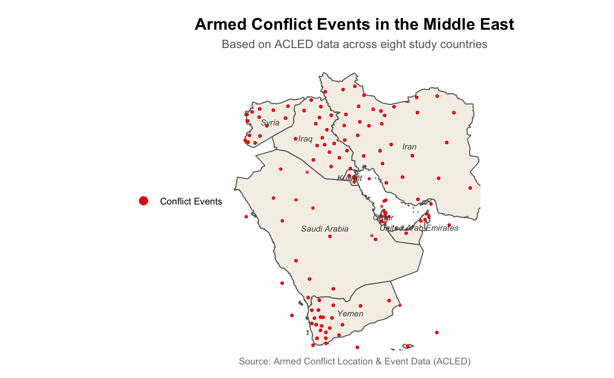
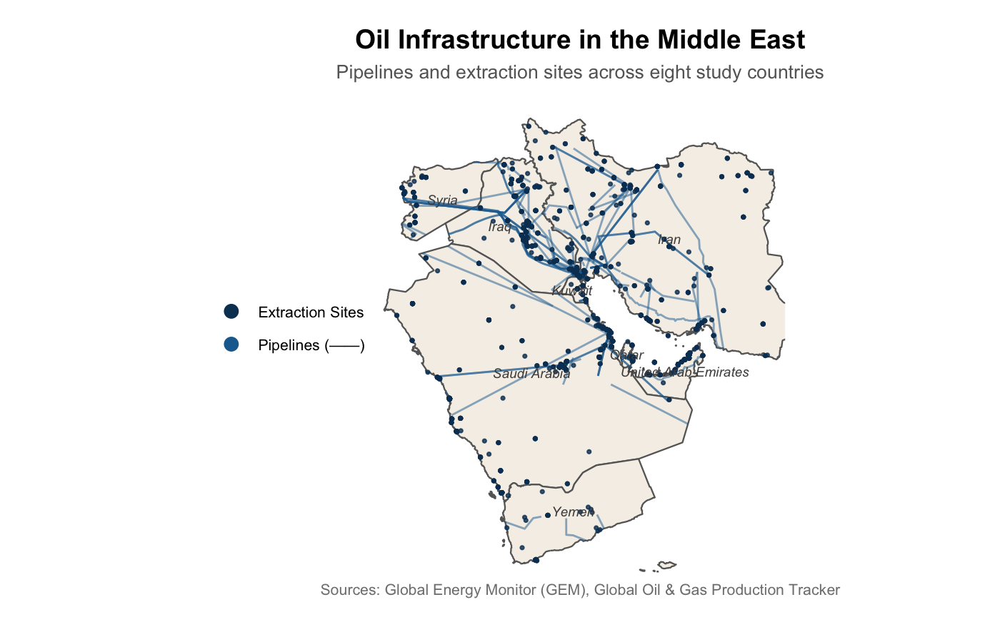
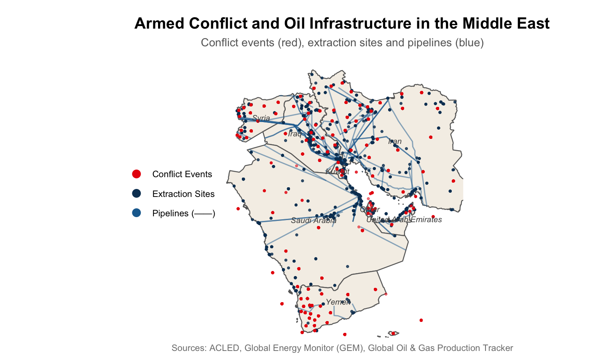
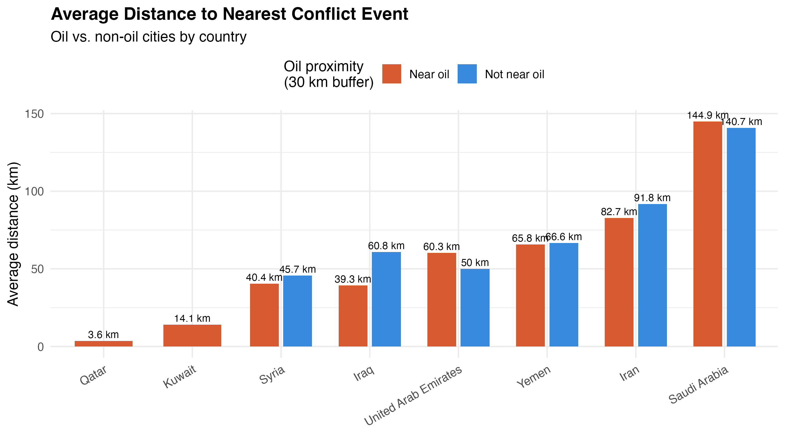
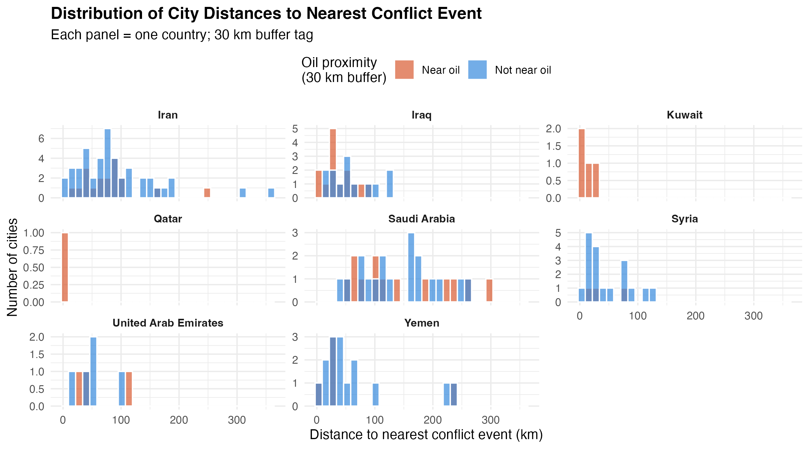
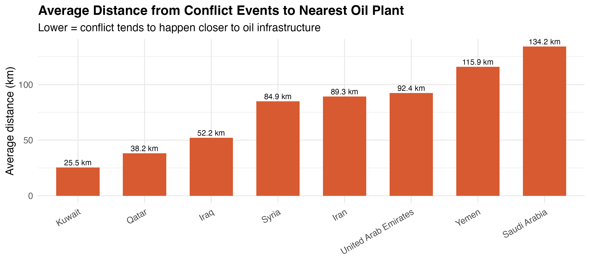
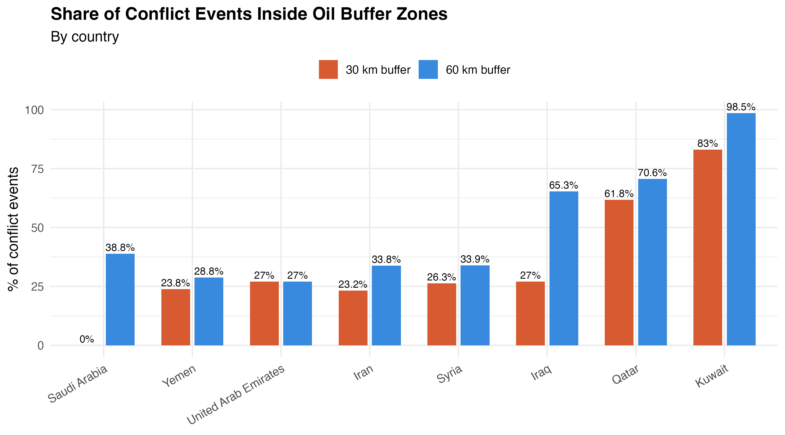

```{r setup, include=FALSE}
knitr::opts_chunk$set(echo = FALSE, message = FALSE, warning = FALSE)
library(sf)
library(tidyverse)

cities_sf   <- readRDS("data/clean/cities_tagged.rds")
conflict_sf <- readRDS("data/clean/conflict_tagged.rds")
oil_sf      <- readRDS("data/clean/gogpt_3857.rds") %>%
  filter(str_detect(Fuel, regex("oil", ignore_case = TRUE)))
oil_buffer_30 <- st_buffer(oil_sf, dist = 30000)
oil_buffer_60 <- st_buffer(oil_sf, dist = 60000)

# Pre-compute all objects needed in the Results section
cities_ttest <- cities_sf %>% st_drop_geometry()

results_table <- cities_ttest %>%
  mutate(oil_tag = if_else(near_oil_30km, "Near oil", "Not near oil")) %>%
  group_by(Country = ADM0NAME, oil_tag) %>%
  summarise(
    n_cities       = n(),
    avg_dist_km    = round(mean(dist_to_conflict_km, na.rm = TRUE), 1),
    median_dist_km = round(median(dist_to_conflict_km, na.rm = TRUE), 1),
    .groups = "drop"
  ) %>%
  arrange(Country, oil_tag)

t_result_30 <- t.test(dist_to_conflict_km ~ near_oil_30km, data = cities_ttest)
t_result_60 <- t.test(dist_to_conflict_km ~ near_oil_60km, data = cities_ttest)

conflict_oil_summary <- conflict_sf %>%
  st_drop_geometry() %>%
  group_by(Country = COUNTRY) %>%
  summarise(
    n_events       = n(),
    avg_dist_km    = round(mean(dist_to_oil_km, na.rm = TRUE), 1),
    median_dist_km = round(median(dist_to_oil_km, na.rm = TRUE), 1),
    .groups = "drop"
  ) %>%
  arrange(avg_dist_km)

buffer_country <- conflict_sf %>%
  st_drop_geometry() %>%
  group_by(Country = COUNTRY) %>%
  summarise(
    n_events    = n(),
    pct_in_30km = round(100 * mean(in_buffer_30), 1),
    pct_in_60km = round(100 * mean(in_buffer_60), 1),
    .groups = "drop"
  ) %>%
  arrange(desc(pct_in_30km))
```

\begin{titlepage}
\centering

\vspace*{3cm}

{\large \textbf{Spatial relationship between oil infrastructure and conflict in the Middle East} \par}

\vspace{1.8cm}

{\normalsize
Erika Yazmín Blanco \\
Felipe Manzi \\
Olta Reçica \\
Olsa Berani
\par}

\vspace{1.2cm}

{\normalsize 2026-03-27}

\vfill

\end{titlepage}

\newpage

\pagenumbering{arabic}

\tableofcontents

\newpage

# Introduction

The spatial distribution of armed conflict is shaped by a combination of political, economic, and geographic factors. In regions such as the Middle East, where oil infrastructure plays a central strategic role, understanding how conflict events are distributed relative to these assets is particularly relevant. Oil infrastructure, including extraction sites, pipelines, and refineries, represents key economic and geopolitical resources. While these assets are often discussed in relation to conflict dynamics, the extent to which conflict events are spatially concentrated around them remains an empirical question.

This project examines whether systematic spatial patterns exist between oil infrastructure and conflict events across eight countries in the Middle East: Saudi Arabia, Iraq, Iran, Kuwait, United Arab Emirates, Qatar, Syria, and Yemen. Specifically, the research question guiding this analysis is: **What is the spatial relationship between oil infrastructure and armed conflict events in the Middle East?**

The analysis evaluates whether proximity-based relationships can be observed using multiple geospatial approaches. Specifically, the study combines city-level distance measures, buffer-level groupings, and conflict-level proximity metrics to provide a comprehensive spatial assessment. The analysis focuses on fixed oil infrastructure, such as plants and processing facilities, treated as discrete strategic assets. Linear infrastructure, such as pipelines, is excluded due to its extensive spatial coverage, which would reduce the analytical precision of proximity-based measures.

# Motivation and Literature Review


# Motivation and Literature Review

A large literature links oil wealth to armed conflict. The core argument is that oil creates strong incentives for violence: valuable resource rents attract armed groups, and control over extraction sites becomes a strategic objective. In this sense, oil increases both the opportunity and the payoff from engaging in conflict. Resource abundance can therefore raise conflict risk by providing revenue to warring parties and increasing the value of territorial control (Humphreys, 2005). Empirical evidence shows that oil, more than other natural resources, is strongly associated with conflict onset and broader societal insecurity (De Soysa & Neumayer, 2015; Ross, 2012).

However, most of this literature works at the country level, asking whether oil-rich countries experience more conflict overall. This approach cannot capture how conflict is distributed within countries. Armed conflict is often concentrated in specific locations rather than spread evenly (Buhaug, 2010). As a result, existing studies do not answer a key question: are conflict events actually located near oil infrastructure on the ground (Colgan, 2016)?

This limitation is particularly evident in the Middle East. The region contains a large share of global oil reserves, and oil infrastructure is concentrated in specific areas. Control over these locations is often strategically important, making them potential focal points for violence. Despite this, there is limited systematic evidence on how conflict events are distributed relative to oil infrastructure across the region.

To provide geographic context, Figures 1, 2, and 3 show the spatial distribution of conflict events, oil infrastructure, and both layers combined across the eight study countries. These maps suggest a visual overlap between oil activity and conflict, motivating a more precise spatial analysis.
```{r map1, echo=FALSE, fig.cap="Figure 1: Armed Conflict Events in the Middle East"}

```
```{r map2, echo=FALSE, fig.cap="Figure 2: Oil Infrastructure in the Middle East"}

```
```{r map3, echo=FALSE, fig.cap="Figure 3: Armed Conflict and Oil Infrastructure in the Middle East"}

```

We shift the focus from country-level analysis to subnational spatial relationships. Specifically, we ask: are conflict events located closer to oil infrastructure than would be expected by chance? The core of our spatial approach relies on buffer zones around oil infrastructure and distance calculations between layers. The chunk below illustrates the key steps:
```{r, eval=FALSE}
# Buffer zones around oil infrastructure
oil_buffer_30 <- st_buffer(oil_sf, dist = 30000)
oil_buffer_60 <- st_buffer(oil_sf, dist = 60000)

# Tag cities based on whether they fall inside each buffer
cities_sf$near_oil_30km <- lengths(st_intersects(cities_sf, oil_buffer_30)) > 0

# Distance from each city to the nearest conflict event
nearest_index <- st_nearest_feature(cities_sf, conflict_sf)
cities_sf$dist_to_conflict_km <- as.numeric(
  st_distance(cities_sf, conflict_sf[nearest_index, ], by_element = TRUE)
) / 1000
```

Using geospatial methods across eight countries, we provide direct evidence on the spatial relationship between oil and conflict. By combining multiple spatial measures, we evaluate the robustness of these patterns and provide a clearer picture of the underlying geographic dynamics.
# Data and Methodology

## Data

The analysis focuses on eight countries in the Middle East: Saudi Arabia, Iraq, Iran, Kuwait, United Arab Emirates, Qatar, Syria, and Yemen. To examine the spatial relationship between oil infrastructure and conflict, the project combines georeferenced data on conflict events, fixed oil and gas infrastructure, populated places, and country boundaries.

**Conflict data come from the Armed Conflict Location & Event Data Project (ACLED)**, using an aggregated weekly dataset for the Middle East. From the raw file, the sample is restricted to the eight study countries. Observations with missing geographic coordinates are removed, and the date variable is standardized. The remaining records are converted into a spatial dataset using the reported longitude and latitude coordinates. Because the source is aggregated at the weekly level, each observation represents a conflict record associated with a specific location and week.

**Oil infrastructure is measured using the Global Oil and Gas Plant Tracker (GOGPT)**. This dataset provides point locations for oil and gas plants and units, together with information such as plant name, operational status, fuel classification, ownership, and capacity. The data are filtered to the study countries, and only observations with valid latitude and longitude are retained. These plant locations constitute the main infrastructure layer used in the empirical analysis.

To represent populated locations, the study uses Natural Earth populated places data. These data provide city point locations and are filtered to the same eight countries. They are used in the city-level analysis, where each city is linked to the nearest conflict event and classified according to its proximity to oil infrastructure.
Country boundaries are taken from Natural Earth administrative polygons. These boundaries are used to define the study area and to provide geographic context for the maps.

All spatial datasets are stored in two coordinate reference systems. Data in EPSG:4326 are used for mapping and visualization, while data in EPSG:3857 are used for buffer construction and distance calculations. This ensures consistency between cartographic presentation and spatial measurement.

## Methodology

The analysis combines three complementary approaches to evaluate the spatial relationship between oil infrastructure and conflict:
buffer-based measures
distance-based measures
group comparisons

This triangulation strengthens the robustness of the findings by identifying patterns that are consistent across different methodological approaches.

### Buffer Analysis and Spatial Classification

First, we constructed buffer zones of 30 km and 60 km around oil infrastructure sites.

Cities are classified based on whether their geographic coordinates fall within these buffer areas. A city is considered to be “within a buffer” if its location intersects with the area defined by the buffer distance around any oil infrastructure site. In practical terms, this means that the city lies within a specified radius (30 km or 60 km) of at least one oil-related location.

Based on this criterion, cities are grouped into two categories:

cities near oil infrastructure (located within the buffer zones)
cities farther from oil infrastructure (located outside the buffer zones)

This classification allows for a comparison between cities that are geographically close to oil infrastructure and those that are not, providing a basis for analyzing differences in their proximity to conflict events.

Similarly, conflict events are classified according to whether they occur within these buffer zones. This allows for the calculation of the share of conflict events located near oil infrastructure.

### City-Level Distance to Conflict

For each city, the distance to the nearest conflict event is calculated using spatial nearest-neighbor methods. Specifically, each city is matched to its closest conflict event, and the geographic distance between the two is computed. This produces a continuous measure of proximity to conflict for every city, allowing for a detailed comparison across locations rather than relying on simple binary classifications.

Cities are then grouped based on their proximity to oil infrastructure, as defined by the buffer zones constructed earlier (e.g., within 30 km or 60 km of oil sites). Within each group, the average distance to the nearest conflict event is calculated. By comparing these averages, the analysis assesses whether cities located near oil infrastructure tend to be systematically closer to conflict events than those located farther away. This approach provides a straightforward way to identify spatial differences in conflict exposure associated with proximity to oil infrastructure.

### Conflict-Level Distance to Oil Infrastructure

Distances from each conflict event to the nearest oil infrastructure site are computed using spatial nearest-neighbor techniques. For each event, the minimum distance to any oil-related site is identified, producing a continuous measure of proximity.

This approach generates a full distribution of distances, which can be summarized using descriptive statistics such as the mean, median, and range. Examining this distribution allows for an assessment of how conflict events are spatially positioned relative to oil infrastructure, including whether they tend to cluster within specific distance bands or are more widely dispersed across the region.

# Results

## Cities Proximity to Conflict

At the 30 km threshold, cities located near oil infrastructure exhibit lower average distances to conflict events compared to those located farther away (approximately 75.6 km vs. 83.6 km). A Welch two-sample t-test confirms that this difference is not statistically significant (t = 0.73, df = 119.3, p = 0.469), suggesting that the modest gap observed at this scale could plausibly arise by chance. At the 60 km threshold, the difference becomes substantially larger. Cities near oil infrastructure are, on average, located approximately 23 km closer to conflict events than those farther away (69.6 km vs. 92.7 km). This difference is statistically significant (t = 2.26, df = 167.6, p = 0.025), indicating that the spatial association between city proximity to oil infrastructure and exposure to conflict is unlikely to be due to random variation alone. 

This pattern indicates that the spatial association between oil infrastructure and conflict is more clearly observable when broader geographic definitions of proximity are considered. The 60 km buffer is the threshold at which the signal becomes statistically detectable with this dataset. Importantly, these results reflect differences in spatial distribution rather than direct causal relationships, and should be interpreted as descriptive patterns.

```{r fig1, out.width="100%", fig.cap="Average distance to nearest conflict event by country. Red = cities near oil infrastructure (30 km buffer); blue = cities not near oil infrastructure."}

```

```{r fig2, out.width="100%", fig.cap="Distribution of city distances to nearest conflict event, by country and oil proximity tag (30 km buffer)."}

```

## Conflict Proximity to Oil Infrastructure

The distribution of distances from conflict events to oil infrastructure shows that conflict typically occurs within a regional range of oil-related locations. The median distance is approximately 81 km, with an average close to 88 km, indicating that while some events occur near infrastructure, many are located at moderate distances. This suggests that conflict is not tightly concentrated around oil sites but tends to occur within broader regions where oil infrastructure is present.

Country-level patterns reveal substantial heterogeneity. Kuwait and Qatar have the shortest average distances (25.5 km and 38.2 km respectively), reflecting their small geographic size and high density of oil infrastructure. Iraq, with the largest number of conflict events (22,541), shows an average distance of 52.2 km, indicating meaningful spatial overlap between conflict and oil sites. At the other extreme, Saudi Arabia and Yemen show average distances exceeding 115 km, suggesting that in these countries conflict events are more spatially separated from oil infrastructure.

```{r fig3, out.width="100%", fig.cap="Average distance from conflict events to nearest oil plant, by country."}

```

## Share of Conflict Events Near Oil Infrastructure

Buffer-based results show that:

Approximately 25% of conflict events occur within 30 km of oil infrastructure
Approximately 40% of conflict events occur within 60 km

This indicates that a substantial share of conflict events takes place in areas geographically close to oil infrastructure, particularly when larger spatial thresholds are considered. However, the majority of conflict events still occur outside these buffers, reinforcing the idea that conflict is not exclusively concentrated near oil sites.

```{r fig4, out.width="100%", fig.cap="Share of conflict events falling inside 30 km and 60 km oil plant buffer zones, by country."}

```

# Conclusions and Limitations

This study identifies consistent spatial patterns between oil infrastructure and the distribution of conflict events in the Middle East.
Across multiple approaches, results suggest that conflict tends to occur relatively closer to oil infrastructure, particularly when broader distance thresholds are considered. However, these patterns are not localized, and conflict events are distributed across a wide geographic range.
However, the observed spatial associations may reflect underlying regional dynamics, such as political instability, geographic clustering, or historical factors, rather than direct relationships between oil infrastructure and conflict occurrence.

Several limitations should be noted:

The analysis does not account for differences in conflict intensity or type
Country-level heterogeneity is not explicitly modeled
Distance-based measures do not capture strategic or political mechanisms

Future research could extend this approach by incorporating temporal dynamics, conflict intensity measures, or additional covariates to better understand the factors underlying these spatial patterns.

# References

Humphreys, M. (2005). Natural resources, conflict, and conflict resolution. *Journal of Conflict Resolution*, 49(4), 508–537.

De Soysa, I., & Neumayer, E. (2015). Is oil different? Evidence from the natural resource curse. *World Development*, 67, 412–425.

Ross, M. L. (2012). *The oil curse: How petroleum wealth shapes the development of nations*. Princeton University Press.

Buhaug, H. (2010). Dude, where’s my conflict? Local determinants of civil war. *Conflict Management and Peace Science*, 27(2), 107–128.

Colgan, J. D. (2016). Oil and revolutionary governments: Fuel for international conflict. *International Organization*, 70(4), 661–694.
