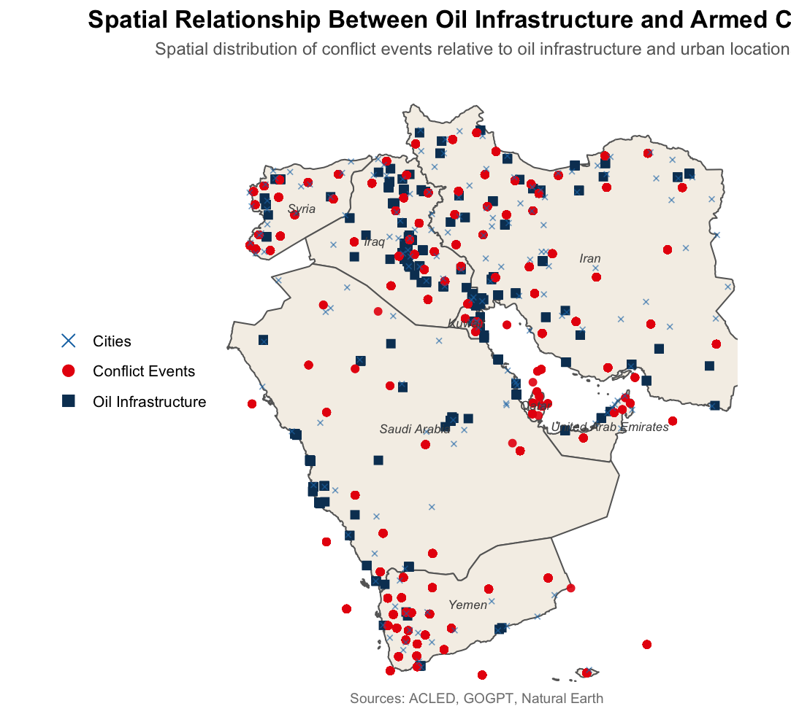

\begin{titlepage}
\centering

\vspace*{4cm}

{\LARGE \textbf{Spatial Relationship Between Oil Infrastructure\\[0.4em] and Conflict in the Middle East} \par}

\vspace{0.6cm}
\noindent\rule{0.5\textwidth}{0.4pt}
\vspace{1.5cm}

{\normalsize
Erika Yazmín Blanco \quad Felipe Manzi \quad Olta Reçica \quad Olsa Berani
\par}

\vspace{0.8cm}

{\small\textit{March 27, 2026}}

\vfill

{\small GIS Final Project}

\end{titlepage}

\newpage

\pagenumbering{arabic}

\tableofcontents

\newpage

# Introduction
The spatial distribution of armed conflict is shaped by a combination of political, economic, and geographic factors. In regions such as the Middle East, where oil infrastructure plays a central strategic role, understanding how conflict events are distributed relative to these assets is particularly relevant. Oil infrastructure, including extraction sites, pipelines, and refineries, represents key economic and geopolitical resources. While these assets are often discussed in relation to conflict dynamics, the extent to which conflict events are spatially concentrated around them remains an empirical question.

This project examines whether systematic spatial patterns exist between oil infrastructure and conflict events across eight countries in the Middle East: Saudi Arabia, Iraq, Iran, Kuwait, United Arab Emirates, Qatar, Syria, and Yemen. Specifically, the research question guiding this analysis is: **What is the spatial relationship between oil infrastructure and armed conflict events in the Middle East?** The analysis evaluates whether proximity-based relationships can be observed using multiple geospatial approaches. Specifically, the study combines city-level distance measures, buffer-level groupings, and conflict-level proximity metrics to provide a comprehensive spatial assessment. In this sense, the study focuses on identifying systematic spatial patterns and assessing whether conflict tends to occur closer to oil infrastructure, and at what geographic scale these patterns emerge. 

By comparing multiple distance thresholds, the study distinguishes between localized proximity to oil infrastructure and broader regional co-location, providing insight into whether conflict is concentrated directly around oil sites or distributed across wider oil-producing regions.The analysis focuses on fixed oil infrastructure, such as plants and processing facilities, treated as discrete strategic assets. Linear infrastructure, such as pipelines, is excluded due to its extensive spatial coverage, which would reduce the analytical precision of proximity-based measures.

# Motivation and Literature Review

A large literature links oil wealth to armed conflict. The core argument is that oil creates strong incentives for violence: valuable resource rents attract armed groups, and control over extraction sites becomes a strategic objective. In this sense, oil increases both the opportunity and the payoff from engaging in conflict. Resource abundance can therefore raise conflict risk by providing revenue to warring parties and increasing the value of territorial control (Humphreys, 2005). Empirical evidence shows that oil, more than other natural resources, is strongly associated with conflict onset and broader societal insecurity (De Soysa & Neumayer, 2015; Ross, 2012).

However, most of this literature works at the country level, asking whether oil-rich countries experience more conflict overall. This approach cannot capture how conflict is distributed within countries. Armed conflict is often concentrated in specific locations rather than spread evenly (Buhaug, 2010). As a result, existing studies do not answer a key question: are conflict events actually located near oil infrastructure on the ground (Colgan, 2016)? This limitation is particularly evident in the Middle East. The region contains a large share of global oil reserves, and oil infrastructure is concentrated in specific areas. Control over these locations is often strategically important, making them potential focal points for violence. Despite this, there is limited systematic evidence on how conflict events are distributed relative to oil infrastructure across the region.

To provide geographic context, Figures 1, 2, and 3 show the spatial distribution of conflict events, oil infrastructure, and both layers combined across the eight study countries. These maps reveal that overlap between conflict events and oil infrastructure is not uniform across the region. Clustering appears strongest in areas such as Iraq and parts of the Gulf, where dense oil infrastructure coincides with a high concentration of conflict events, while countries such as Saudi Arabia display a more dispersed pattern. This visual evidence suggests that any spatial association is likely to operate at a regional rather than strictly local scale.

```{r map_1, echo=FALSE, out.width="90%",fig.align="center",fig.pos="H",fig.cap="Spatial overlap between conflict events and oil infrastructure in the Middle East"}
knitr::include_graphics("maps/m1.png")
```

```{r map_2, echo=FALSE, out.width="90%",fig.align="center",fig.pos="H",fig.cap="Spatial overlap between conflict events and oil infrastructure in the Middle East"}
knitr::include_graphics("maps/m2.png")
```

```{r map_3, echo=FALSE, out.width="90%",fig.align="center",fig.pos="H",fig.cap="Spatial overlap between conflict events and oil infrastructure in the Middle East"}
knitr::include_graphics("maps/m3.png")
```

\newpage
Moreover, we shift the focus from country-level analysis to subnational spatial relationships. Specifically, we ask: are conflict events located closer to oil infrastructure than would be expected by chance? The core of our spatial approach relies on buffer zones around oil infrastructure and distance calculations between layers. Using geospatial methods across eight countries, we provide direct evidence on the spatial relationship between oil and conflict. By combining multiple spatial measures, we evaluate the robustness of these patterns and provide a clearer picture of the underlying geographic dynamics.

# Data and Methodology

## Data

The analysis focuses on the following countries in the Middle East: Saudi Arabia, Iraq, Iran, Kuwait, United Arab Emirates, Qatar, Syria, and Yemen. To examine the spatial relationship between oil infrastructure and conflict, the project combines georeferenced data on conflict events, fixed oil and gas infrastructure, populated places, and country boundaries.

**Conflict data come from the Armed Conflict Location & Event Data Project (ACLED)**, using an aggregated weekly dataset for the Middle East (file: *Middle-East\_aggregated\_data\_up\_to-2026-03-07*). From the raw file, the sample is restricted to the eight study countries and to weeks beginning on or after 1 January 2010. Observations with missing centroid coordinates are removed, and the date variable is standardized. The remaining records are converted into a spatial dataset using the reported centroid longitude and latitude. Because the source is aggregated at the weekly level, each observation represents a single spatial record for a given administrative location and week, not an individual incident. All results expressed as shares or counts of "conflict records" refer to these weekly location-level aggregates.

```{r acled_data, eval=FALSE}
acled_raw <- read_xlsx("data/Middle-East_aggregated_data_up_to-2026-03-07.xlsx")

acled_clean <- acled_raw %>%
  filter(COUNTRY %in% study_countries) %>%
  mutate(WEEK = as.Date(WEEK)) %>%
  filter(
    !is.na(CENTROID_LONGITUDE),
    !is.na(CENTROID_LATITUDE)
  ) %>%
  st_as_sf(
    coords = c("CENTROID_LONGITUDE", "CENTROID_LATITUDE"),
    crs = 4326,
    remove = FALSE
  )
```

**Oil infrastructure is measured using the Global Oil and Gas Plant Tracker (GOGPT, January 2026 release)**. This dataset provides point locations for oil and gas plants and units, together with information such as plant name, operational status, fuel classification, ownership, and capacity. The data are filtered to the study countries, retaining only records whose fuel field contains the string "oil" and for which valid latitude and longitude coordinates exist. No restriction is applied by operational status: the infrastructure layer therefore includes facilities classified as operating, proposed, under construction, retired, and cancelled. This choice maximises spatial coverage but means that some sites in the analysis may not represent currently active installations.

```{r oil_data, eval=FALSE}
gogpt_raw <- read_xlsx(
  "data/Global-Oil-and-Gas-Plant-Tracker-GOGPT-January-2026.xlsx",
  sheet = "Gas & Oil Units"
)

gogpt_clean <- gogpt_raw %>%
  filter(Country %in% study_countries) %>%
  drop_na(Latitude, Longitude) %>%
  st_as_sf(coords = c("Longitude", "Latitude"), crs = 4326, remove = FALSE)
```

To represent populated locations, the study uses Natural Earth populated places data (10m scale). These data provide point locations for settlements of all sizes and are filtered to the same eight countries, yielding a sample that includes cities, towns, and smaller populated places with no population threshold applied. Each settlement is treated as a single observation with equal weight in the city-level analysis, where it is linked to the nearest conflict record and classified according to its proximity to oil infrastructure.

```{r cities_data, eval=FALSE}
places_raw <- ne_download(
  scale = 10,
  type = "populated_places",
  category = "cultural",
  returnclass = "sf"
)

places_clean <- places_raw %>%
  filter(ADM0NAME %in% study_countries)
```

Country boundaries are taken from Natural Earth administrative polygons. These boundaries are used to define the study area and to provide geographic context for the maps.

```{r countries_data, eval=FALSE}
countries_raw <- ne_download(
  scale = 10,
  type = "admin_0_countries",
  category = "cultural",
  returnclass = "sf"
)

countries_clean <- countries_raw %>%
  filter(ADMIN %in% study_countries)
```

All spatial datasets are stored in two coordinate reference systems. Data in EPSG:4326 (WGS84 geographic coordinates) are used for mapping and visualization. Data in EPSG:3857 (Web Mercator) are used for buffer construction and distance calculations, as this projection provides metric units suitable for Euclidean distance measurement. Because Web Mercator introduces modest distance distortion at higher latitudes (approximately 2–3% at the northern boundary of the study region near Iran and Syria), all reported distances should be interpreted as approximate rather than exact values.

```{r crs_preparation, eval=FALSE}
# Geographic CRS (for mapping)
acled_4326 <- acled_clean
gogpt_4326 <- gogpt_clean
places_4326 <- places_clean
countries_4326 <- countries_clean
# Projected CRS (for distance & buffers)
acled_3857 <- st_transform(acled_clean, 3857)
gogpt_3857 <- st_transform(gogpt_clean, 3857)
places_3857 <- st_transform(places_clean, 3857)
countries_3857 <- st_transform(countries_clean, 3857)
```

## Methodology

The analysis combines three complementary perspectives to examine the spatial relationship between oil infrastructure and conflict:

1. City-level analysis, which evaluates how proximity to oil infrastructure relates to the distance between populated locations and conflict events
2. Conflict-event-level analysis, which measures how close conflict events occur to the nearest oil sites
3. Buffer-level analysis, which provides a direct assessment of spatial overlap by identifying the share of events occurring within specified distances of oil infrastructure

Together, these perspectives provide a consistent descriptive picture of how conflict is spatially distributed relative to oil infrastructure across the region.


### Buffer Analysis and Spatial Classification

First, we constructed circular buffer zones of exactly 30 km and 60 km radius around each oil infrastructure site using planar Euclidean geometry in EPSG:3857. Individual plant buffers are not dissolved prior to classification: a city or conflict record is classified as “near oil” if its point geometry falls within the buffer of any single plant, which is operationally equivalent to testing against a dissolved union of all buffers.
The spatial extent of these buffer zones and their relationship to urban locations is illustrated in Figures 4 and 5.

```{r buffer_maps, echo=FALSE, out.width=c("45%", "45%"), fig.align="center", fig.pos="H", fig.cap="Comparison of 30 km and 60 km buffer zones around oil infrastructure"}
knitr::include_graphics(c("maps/buffer_30.png", "maps/buffer_60.png"))
```

Cities are classified based on whether their geographic coordinates fall within these buffer areas. A city is considered to be “within a buffer” if its location intersects with the area defined by the buffer distance around any oil infrastructure site. In practical terms, this means that the city lies within a specified radius (30 km or 60 km) of at least one oil-related location.

Based on this criterion, cities are grouped into two categories:

1. Cities near oil infrastructure (located within the buffer zones)
2. Cities farther from oil infrastructure (located outside the buffer zones)

This classification allows for a comparison between cities that are geographically close to oil infrastructure and those that are not, providing a basis for analyzing differences in their proximity to conflict events. It should be noted that in Kuwait and Qatar, all cities in the dataset fall within 30 km of an oil plant, leaving no “farther from oil” comparison group for those countries at the 30 km threshold; they therefore contribute observations only to the near-oil group in that analysis. Similarly, conflict records are classified according to whether they occur within these buffer zones. This allows for the calculation of the share of weekly conflict records located near oil infrastructure.

To construct the buffers and the city classification, we include:
```{r, eval=FALSE}
# Create unified oil infrastructure geometry
oil_union <- st_union(oil_sf)

# Generate buffer zones (30 km and 60 km)
oil_buffer_30 <- st_buffer(oil_union, dist = 30000)
oil_buffer_60 <- st_buffer(oil_union, dist = 60000)

# Classify cities based on proximity to oil infrastructure
cities_sf$near_oil_30km <- lengths(
  st_intersects(cities_sf, oil_buffer_30)
) > 0

cities_sf$near_oil_60km <- lengths(
  st_intersects(cities_sf, oil_buffer_60)
) > 0
```

### City-Level Distance to Conflict

For each city, the distance to the nearest conflict event is calculated using spatial nearest-neighbor methods. Specifically, each city is matched to its closest conflict event, and the geographic distance between the two is computed. This produces a continuous measure of proximity to conflict for every city, allowing for a detailed comparison across locations rather than relying on simple binary classifications.

```{r, eval=FALSE}
# Identify nearest conflict event for each city
nearest_index <- st_nearest_feature(cities_sf, conflict_sf)

# Compute distance from each city to nearest conflict event (in km)
cities_sf$dist_to_conflict_km <- as.numeric(
  st_distance(cities_sf, conflict_sf[nearest_index, ], by_element = TRUE)
) / 1000
```

Cities are then grouped based on their proximity to oil infrastructure, as defined by the buffer zones constructed earlier (e.g., within 30 km or 60 km of oil sites). Within each group, the average distance to the nearest conflict record is calculated.By comparing these averages across groups, the analysis assesses whether cities located near oil infrastructure tend to be systematically closer to conflict events than those located farther away. 

```{r, eval=FALSE}
# Mean distance to conflict (30 km)
cities_sf %>%
  st_drop_geometry() %>%
  group_by(near_oil_30km) %>%
  summarise(mean_distance = mean(dist_to_conflict_km, na.rm = TRUE))

# Mean distance to conflict (60 km)
cities_sf %>%
  st_drop_geometry() %>%
  group_by(near_oil_60km) %>%
  summarise(mean_distance = mean(dist_to_conflict_km, na.rm = TRUE))
```

The comparison is made using a Welch two-sample t-test, which does not assume equal variances between groups. The test is run separately for each buffer threshold; no correction for multiple comparisons is applied across the two thresholds. Observations from all eight countries are pooled into a single test, so the result reflects a regional average rather than a country-stratified effect.

### Conflict-Level Distance to Oil Infrastructure

For each conflict record, the minimum Euclidean distance to any oil infrastructure site is computed from a pairwise distance matrix calculated in EPSG:3857, producing a continuous nearest-distance measure for every observation.

```{r, eval=FALSE}
# Compute distance from each conflict event to nearest oil infrastructure site
conflict_to_oil_dist <- st_distance(conflict_sf, oil_sf)

conflict_sf$dist_to_oil_km <- apply(
  conflict_to_oil_dist, 1, min) / 1000
```

This approach generates a full distribution of distances, which can be summarized using descriptive statistics such as the mean, median, and range. Examining this distribution allows for an assessment of how conflict events are spatially positioned relative to oil infrastructure, including whether they tend to cluster within specific distance bands or are more widely dispersed across the region.

# Results

To provide an overall spatial overview of the relationship between oil infrastructure and armed conflict, Figure 6 combines all layers into a single map. 

```{r combined_map, echo=FALSE, out.width="75%", fig.align="center", fig.pos="H", fig.cap="Spatial distribution of conflict events, cities, and oil infrastructure in the Middle East"}

```

This section presents descriptive evidence on how conflict events and oil infrastructure are spatially related across the study region. The analysis combines three complementary measures: city-level distances to conflict, conflict-level distances to oil infrastructure, and the share of conflict events located within buffer zones around oil sites. Each approach captures a different dimension of spatial proximity, and together they provide a consistent picture of how conflict is distributed relative to oil infrastructure.

Specifically, the city-level analysis captures how exposure to conflict varies across populated locations depending on their proximity to oil infrastructure. The conflict-level analysis reverses this perspective, measuring how close conflict events occur to oil sites. Finally, the buffer-based approach provides a direct measure of spatial overlap. Consistency across these three perspectives strengthens the interpretation of the observed spatial patterns.

## Cities Proximity to Conflict

To assess whether cities near oil infrastructure are systematically closer to conflict, each city was first tagged based on whether it falls within a 30 km or 60 km buffer around any oil plant. Each city was then matched to its nearest recorded conflict event using a spatial nearest-neighbor approach, producing one continuous distance measure per city. Cities were then grouped by their oil proximity tag and the average distance to conflict was compared across the two groups, as shown in the code blocks below.

```{r results_summary, echo=TRUE, eval=FALSE}
cities_sf %>%
  st_drop_geometry() %>%
  mutate(oil_tag = if_else(near_oil_30km, "Near oil", "Not near oil")) %>%
  group_by(Country = ADM0NAME, oil_tag) %>%
  summarise(
    n_cities       = n(),
    avg_dist_km    = round(mean(dist_to_conflict_km, na.rm = TRUE), 1),
    median_dist_km = round(median(dist_to_conflict_km, na.rm = TRUE), 1),
    .groups = "drop"
  )
```

```{r ttest, echo=TRUE, eval=FALSE}
t.test(dist_to_conflict_km ~ near_oil_30km, data = cities_sf)
t.test(dist_to_conflict_km ~ near_oil_60km, data = cities_sf)
```

At the 30 km threshold, cities located near oil infrastructure exhibit lower average distances to conflict events compared to those located farther away (approximately 75.6 km vs. 83.6 km). A Welch two-sample t-test confirms that this difference is not statistically significant (t = 0.73, df = 119.3, p = 0.469), suggesting that the modest gap observed at this scale could plausibly arise by chance. The Welch variant is used rather than a standard t-test because it does not assume equal variance between groups, which is appropriate given the unequal group sizes across buffer thresholds.

At the 60 km threshold, the difference becomes substantially larger. Cities near oil infrastructure are, on average, located approximately 23 km closer to conflict events than those farther away (69.6 km vs. 92.7 km). This difference is statistically significant (t = 2.26, df = 167.6, p = 0.025), indicating that the spatial association between city proximity to oil infrastructure and exposure to conflict is unlikely to be due to random variation alone.

The sensitivity of the result to buffer size is itself informative. At 30 km the signal is weak and insignificant, while at 60 km it becomes detectable. Taken together, these results indicate that proximity to oil infrastructure is not associated with sharply localized differences in conflict exposure at very short distances, but becomes more apparent when broader spatial scales are considered. This suggests that conflict is not tightly concentrated around individual oil facilities, but instead tends to occur within wider regions where oil infrastructure is present.

This pattern is consistent with the spatial distribution shown in Figure 5, where conflict events and oil infrastructure frequently occupy the same broader geographic areas without being directly co-located at specific sites. The visual evidence supports the interpretation that the relationship operates at a regional scale rather than through immediate proximity to individual facilities.

```{r fig1, out.width="100%", fig.cap="Average distance to nearest conflict event by country. Red = cities near oil infrastructure (30 km buffer); blue = cities not near oil infrastructure."}
knitr::include_graphics("figures/fig1_bar_chart.png")
```

```{r fig2, out.width="100%", fig.pos="H", fig.cap="Distribution of city distances to nearest conflict event, by country and oil proximity tag (30 km buffer)."}
knitr::include_graphics("figures/fig2_distribution.png")
```

\FloatBarrier

## Conflict Proximity to Oil Infrastructure

To complement the city-level analysis, the direction of measurement is reversed: rather than asking how far cities are from conflict, we ask how far each conflict event is from its nearest oil plant. For each of the 96,906 conflict events in the dataset, the minimum distance to any oil plant was computed using the full pairwise distance matrix, producing a continuous proximity measure for every event. The overall distribution shows that conflict typically occurs within a regional range of oil-related locations. The median distance is approximately 81 km, with an average close to 88 km, indicating that while some events occur near infrastructure, many are located at moderate distances. This suggests that conflict is not tightly concentrated around oil sites but tends to occur within broader regions where oil infrastructure is present.

Country-level patterns reveal substantial heterogeneity. Kuwait and Qatar have the shortest average distances (25.5 km and 38.2 km respectively), reflecting their small geographic size and high density of oil infrastructure. Iraq, with the largest number of conflict events (22,541), shows an average distance of 52.2 km, indicating meaningful spatial overlap between conflict and oil sites. At the other extreme, Saudi Arabia and Yemen show average distances exceeding 115 km, suggesting that in these countries conflict events are more spatially separated from oil infrastructure.

Overall, the distribution of distances reinforces the idea that conflict is not narrowly concentrated around oil infrastructure. Instead, events tend to occur within a moderate distance range, indicating a broader geographic association. This further supports the interpretation that oil infrastructure and conflict are co-located at the regional level rather than through direct spatial targeting of specific sites.

```{r fig3, out.width="100%", fig.cap="Average distance from conflict events to nearest oil plant, by country."}
knitr::include_graphics("figures/fig3_conflict_to_oil.png")
```

## Share of Conflict Events Near Oil Infrastructure

As a third and complementary measure, each conflict event was classified as falling inside or outside the 30 km and 60 km buffer zones constructed around oil plants. This binary classification provides a straightforward summary of spatial overlap between conflict and oil, and serves as a direct check on the distance-based findings above. Buffer-based results show that approximately 25% of conflict events occur within 30 km of oil infrastructure, rising to approximately 40% within 60 km. Given that oil plants occupy only a small fraction of the total land area across the eight study countries, these shares represent a meaningful spatial concentration. 

The country-level breakdown in Figure 4 shows where this concentration is strongest: Kuwait and Qatar have the highest shares, while Yemen and Saudi Arabia have the lowest, consistent with the distance-based findings in the previous section. However, the majority of conflict events still occur outside these buffers, reinforcing the idea that conflict is not exclusively concentrated near oil sites and that other geographic and political factors also shape its distribution.

Importantly, the increase in the share of conflict events from 30 km to 60 km buffers highlights the importance of spatial scale. While a relatively small proportion of events occur in the immediate vicinity of oil infrastructure, a substantially larger share falls within a broader surrounding area. This pattern is consistent with a regional clustering of conflict in oil-producing zones rather than direct concentration at infrastructure sites.

```{r fig4, out.width="100%", fig.pos="H", fig.cap="Share of conflict events falling inside 30 km and 60 km oil plant buffer zones, by country."}
knitr::include_graphics("figures/fig4_buffer_share.png")
```

\FloatBarrier

# Conclusions and Limitations

This study provides consistent descriptive evidence of a spatial association between oil infrastructure and the distribution of conflict events in the Middle East. Across multiple measures, conflict is observed to occur relatively closer to oil infrastructure when broader spatial scales are considered. However, this relationship is not highly localized: conflict events are not concentrated directly at oil sites, but are instead distributed across wider regions in which oil infrastructure is present. However, the observed spatial associations may reflect underlying regional dynamics, such as political instability, geographic clustering, or historical factors, rather than direct relationships between oil infrastructure and conflict occurrence.

Several limitations should be noted. First, the conflict dataset contains weekly location-level aggregate records rather than individual incidents. Summary statistics and buffer shares describe the distribution of these aggregates; they do not directly map to counts of discrete events or casualties. Second, the oil infrastructure layer includes facilities of all operational statuses (operating, proposed, under construction, retired, and cancelled) alongside active installations. Including non-operational sites may overstate the geographic footprint of active infrastructure and thus inflate apparent proximity.

Third, all distance and buffer calculations are performed in Web Mercator (EPSG:3857), which introduces modest distance distortion at higher latitudes. Reported distances are therefore approximate. Fourth, the t-tests pool observations from all eight countries without country-fixed effects or adjustment for spatial autocorrelation. Countries differ substantially in geographic size, oil density, and conflict patterns; the pooled test reflects a regional average that may mask important within-country heterogeneity. Additionally, two buffer thresholds are tested without a multiple-comparison correction, so the headline 60 km result (p = 0.025) should be treated as marginal.

Fifth, cities in the Natural Earth populated places dataset are treated with equal weight regardless of population size, giving equivalent influence to major cities and small settlements. Finally, the analysis does not include a null-model benchmark for the buffer share figures, and distance-based measures do not capture strategic or political mechanisms linking oil infrastructure to conflict. Future research could extend this approach by incorporating a randomisation-based spatial null model, restricting infrastructure to operating facilities, applying country-stratified comparisons, and introducing temporal dynamics or conflict intensity measures to better understand the factors underlying these spatial patterns.

Taken together, the findings suggest that oil infrastructure is best understood as a regional feature shaping the geography of conflict rather than a point-specific target, highlighting the importance of spatial scale in interpreting resource–conflict relationships.

\newpage

# References

Humphreys, M. (2005). Natural resources, conflict, and conflict resolution. *Journal of Conflict Resolution*, 49(4), 508–537.

De Soysa, I., & Neumayer, E. (2015). Is oil different? Evidence from the natural resource curse. *World Development*, 67, 412–425.

Ross, M. L. (2012). *The oil curse: How petroleum wealth shapes the development of nations*. Princeton University Press.

Buhaug, H. (2010). Dude, where’s my conflict? Local determinants of civil war. *Conflict Management and Peace Science*, 27(2), 107–128.

Colgan, J. D. (2016). Oil and revolutionary governments: Fuel for international conflict. *International Organization*, 70(4), 661–694.

\newpage

# Appendix

This appendix presents the complete analysis pipeline from data cleaning through to final results. All code chunks are shown for transparency but are not executed during rendering (`eval=FALSE`).

## A1. Data Cleaning

```{r appendix_cleaning_libs, eval=FALSE}
library(tidyverse)
library(sf)
library(readxl)
library(rnaturalearth)
library(rnaturalearthdata)
library(stringr)

dir.create("data/clean", recursive = TRUE, showWarnings = FALSE)

study_countries <- c(
  "Saudi Arabia", "Iraq", "Iran", "Kuwait",
  "United Arab Emirates", "Qatar", "Syria", "Yemen"
)

save_dual_crs <- function(sf_obj, file_path) {
  saveRDS(
    list(
      crs_4326 = st_transform(sf_obj, 4326),
      crs_3857 = st_transform(sf_obj, 3857)
    ),
    file_path
  )
}
```

```{r appendix_cleaning_acled, eval=FALSE}
# =============================================================================
# 1. ACLED
# =============================================================================

acled_raw <- read_xlsx("data/Middle-East_aggregated_data_up_to-2026-03-07.xlsx")

acled_clean <- acled_raw %>%
  filter(COUNTRY %in% study_countries) %>%
  mutate(
    WEEK = as.Date(WEEK)
  ) %>%
  filter(
    !is.na(CENTROID_LONGITUDE),
    !is.na(CENTROID_LATITUDE)
  ) %>%
  st_as_sf(
    coords = c("CENTROID_LONGITUDE", "CENTROID_LATITUDE"),
    crs = 4326,
    remove = FALSE
  )

save_dual_crs(acled_clean, "data/clean/acled_clean.rds")

cat(
  "ACLED:",
  nrow(acled_clean), "rows across",
  n_distinct(acled_clean$COUNTRY), "countries\n"
)
```

```{r appendix_cleaning_gem, eval=FALSE}
# =============================================================================
# 2. GEM — Oil / NGL Pipelines
# =============================================================================

gem_raw <- st_read("data/GEM-GOIT-Oil-NGL-Pipelines-2025-03.geojson")

gem_clean <- gem_raw %>%
  filter(
    str_detect(
      coalesce(Countries, ""),
      regex(str_c(study_countries, collapse = "|"), ignore_case = TRUE)
    ) |
      StartCountry %in% study_countries |
      EndCountry %in% study_countries
  ) %>%
  filter(!st_is_empty(geometry)) %>%
  st_transform(4326) %>%
  select(ProjectID, PipelineName, Countries, Status,
         Capacity, CapacityUnits, LengthMergedKm,
         StartLocation, StartCountry,
         EndLocation,   EndCountry,
         RouteType, RouteAccuracy, LastUpdated,
         geometry)

gem_3857 <- st_transform(gem_clean, 3857)

saveRDS(gem_clean, "data/clean/gem_clean.rds")
saveRDS(gem_3857,  "data/clean/gem_3857.rds")
```

```{r appendix_cleaning_places, eval=FALSE}
# =============================================================================
# 3. Natural Earth populated places
# =============================================================================

places_raw <- ne_download(
  scale = 10,
  type = "populated_places",
  category = "cultural",
  returnclass = "sf"
)

places_clean <- places_raw %>%
  filter(ADM0NAME %in% study_countries)

save_dual_crs(places_clean, "data/clean/places_clean.rds")
```

```{r appendix_cleaning_gogpt, eval=FALSE}
# =============================================================================
# 4. Global Oil and Gas Plant Tracker (GOGPT)
# =============================================================================

gogpt_raw <- read_xlsx(
  "data/Global-Oil-and-Gas-Plant-Tracker-GOGPT-January-2026.xlsx",
  sheet = "Gas & Oil Units"
)

gogpt_clean <- gogpt_raw %>%
  rename(
    Country        = `Country/Area`,
    PlantName      = `Plant name`,
    UnitName       = `Unit name`,
    CapacityMW     = `Capacity (MW)`,
    StartYear      = `Start year`,
    RetiredYear    = `Retired year`,
    Operators      = `Operator(s)`,
    Owners         = `Owner(s)`,
    StateProvince  = `State/Province`,
    LocationAcc    = `Location accuracy`,
    FuelClass      = `Fuel classification?`,
    GEM_UnitID     = `GEM unit ID`,
    GEM_LocationID = `GEM location ID`
  ) %>%
  filter(Country %in% study_countries) %>%
  drop_na(Latitude, Longitude) %>%
  st_as_sf(coords = c("Longitude", "Latitude"), crs = 4326, remove = FALSE) %>%
  select(GEM_UnitID, GEM_LocationID, PlantName, UnitName, Country,
         Fuel, FuelClass, CapacityMW, Status, StartYear, RetiredYear,
         Operators, Owners, StateProvince, City,
         LocationAcc, Latitude, Longitude, geometry)

gogpt_3857 <- st_transform(gogpt_clean, 3857)

saveRDS(gogpt_clean, "data/clean/gogpt_clean.rds")
saveRDS(gogpt_3857,  "data/clean/gogpt_3857.rds")
```

```{r appendix_cleaning_countries, eval=FALSE}
# =============================================================================
# 5. Natural Earth country boundaries
# =============================================================================

countries_raw <- ne_download(
  scale = 10,
  type = "admin_0_countries",
  category = "cultural",
  returnclass = "sf"
)

countries_clean <- countries_raw %>%
  filter(ADMIN %in% study_countries)

save_dual_crs(countries_clean, "data/clean/countries_clean.rds")
```

## A2. Baseline Maps

```{r appendix_maps_load, eval=FALSE}
library(sf)
library(ggplot2)
library(ggdensity)

conflict_list  <- readRDS("data/clean/acled_clean.rds")
conflict       <- conflict_list$crs_4326

countries_list <- readRDS("data/clean/countries_clean.rds")
countries      <- countries_list$crs_4326

gem   <- readRDS("data/clean/gem_clean.rds")
gogpt <- readRDS("data/clean/gogpt_clean.rds")
```

```{r appendix_map1, eval=FALSE}
# Map 1: Armed conflict events
legend_data1 <- data.frame(
  x = c(0), y = c(0), type = c("Conflict Events")
)

ggplot() +
  geom_sf(data = countries, fill = "#f5f0e8", color = "grey40", linewidth = 0.4) +
  geom_sf(data = conflict, color = "#e8000d", size = 0.6, alpha = 0.7) +
  geom_point(data = legend_data1, aes(x = x, y = y, color = type), size = 0, alpha = 0) +
  geom_sf_text(data = countries, aes(label = ADMIN), size = 2.5, color = "grey30", fontface = "italic") +
  scale_color_manual(
    name   = NULL,
    values = c("Conflict Events" = "#e8000d"),
    guide  = guide_legend(override.aes = list(size = 3, alpha = 1))
  ) +
  coord_sf(xlim = c(34, 62), ylim = c(12, 42), expand = FALSE) +
  labs(
    title    = "Armed Conflict Events in the Middle East",
    subtitle = "Based on ACLED data across eight study countries",
    caption  = "Source: Armed Conflict Location & Event Data (ACLED)"
  ) +
  theme_void() +
  theme(
    plot.title      = element_text(size = 14, face = "bold", hjust = 0.5),
    plot.subtitle   = element_text(size = 10, color = "grey40", hjust = 0.5),
    plot.caption    = element_text(size = 8,  color = "grey50", hjust = 0.5),
    plot.margin     = margin(10, 10, 10, 10),
    legend.position = "left",
    legend.text     = element_text(size = 8)
  )
```

```{r appendix_map2, eval=FALSE}
# Map 2: Oil infrastructure
gem_clipped <- st_intersection(gem, st_union(countries))

legend_data2 <- data.frame(
  x = c(0, 0), y = c(0, 0),
  type = c("Extraction Sites", "Pipelines (——)")
)

ggplot() +
  geom_sf(data = countries, fill = "#f5f0e8", color = "grey40", linewidth = 0.4) +
  geom_sf(data = gem_clipped, color = "#1a6b9e", linewidth = 0.5, alpha = 0.5) +
  geom_sf(data = gogpt, color = "#0a3d62", size = 0.6, alpha = 0.8) +
  geom_point(data = legend_data2, aes(x = x, y = y, color = type), size = 0, alpha = 0) +
  geom_sf_text(data = countries, aes(label = ADMIN), size = 2.5, color = "grey30", fontface = "italic") +
  scale_color_manual(
    name   = NULL,
    values = c("Extraction Sites" = "#0a3d62", "Pipelines (——)" = "#1a6b9e"),
    guide  = guide_legend(override.aes = list(size = 3, alpha = 1))
  ) +
  coord_sf(xlim = c(34, 62), ylim = c(12, 42), expand = FALSE) +
  labs(
    title    = "Oil Infrastructure in the Middle East",
    subtitle = "Pipelines and extraction sites across eight study countries",
    caption  = "Sources: Global Energy Monitor (GEM), Global Oil & Gas Production Tracker"
  ) +
  theme_void() +
  theme(
    plot.title      = element_text(size = 14, face = "bold", hjust = 0.5),
    plot.subtitle   = element_text(size = 10, color = "grey40", hjust = 0.5),
    plot.caption    = element_text(size = 8,  color = "grey50", hjust = 0.5),
    plot.margin     = margin(10, 10, 10, 10),
    legend.position = "left",
    legend.text     = element_text(size = 8)
  )
```

```{r appendix_map3, eval=FALSE}
# Map 3: Combined overlay
legend_data3 <- data.frame(
  x = c(0, 0, 0), y = c(0, 0, 0),
  type = c("Conflict Events", "Extraction Sites", "Pipelines (——)")
)

ggplot() +
  geom_sf(data = countries, fill = "#f5f0e8", color = "grey40", linewidth = 0.4) +
  geom_sf(data = gem_clipped, color = "#1a6b9e", linewidth = 0.5, alpha = 0.5) +
  geom_sf(data = gogpt, color = "#0a3d62", size = 0.6, alpha = 0.8) +
  geom_sf(data = conflict, color = "#e8000d", size = 0.6, alpha = 0.5) +
  geom_point(data = legend_data3, aes(x = x, y = y, color = type), size = 0, alpha = 0) +
  geom_sf_text(data = countries, aes(label = ADMIN), size = 2.5, color = "grey30", fontface = "italic") +
  scale_color_manual(
    name   = NULL,
    values = c("Conflict Events" = "#e8000d", "Extraction Sites" = "#0a3d62", "Pipelines (——)" = "#1a6b9e"),
    guide  = guide_legend(override.aes = list(size = 3, alpha = 1))
  ) +
  coord_sf(xlim = c(34, 62), ylim = c(12, 42), expand = FALSE) +
  labs(
    title    = "Armed Conflict and Oil Infrastructure in the Middle East",
    subtitle = "Conflict events (red), extraction sites and pipelines (blue)",
    caption  = "Sources: ACLED, Global Energy Monitor (GEM), Global Oil & Gas Production Tracker"
  ) +
  theme_void() +
  theme(
    plot.title      = element_text(size = 14, face = "bold", hjust = 0.5),
    plot.subtitle   = element_text(size = 10, color = "grey40", hjust = 0.5),
    plot.caption    = element_text(size = 8,  color = "grey50", hjust = 0.5),
    plot.margin     = margin(10, 10, 10, 10),
    legend.position = "left",
    legend.text     = element_text(size = 8)
  )
```

## A3. Buffer Construction, City Tagging, and Distance Calculations

```{r appendix_spatial_setup, eval=FALSE}
library(sf)
library(dplyr)
library(stringr)
library(rnaturalearth)
library(ggplot2)

gogpt_3857   <- readRDS("data/clean/gogpt_3857.rds")
acled        <- readRDS("data/clean/acled_clean.rds")
countries    <- readRDS("data/clean/countries_clean.rds")

countries_sf <- countries$crs_3857
conflict_sf  <- acled$crs_3857 %>%
  filter(WEEK >= as.Date("2010-01-01")) %>%
  st_make_valid()

oil_sf <- gogpt_3857 %>%
  filter(str_detect(tolower(Fuel), "oil")) %>%
  st_make_valid()

oil_sf <- st_intersection(oil_sf, st_union(countries_sf))
```

```{r appendix_cities, eval=FALSE}
country_names <- c(
  "Saudi Arabia", "Iraq", "Iran", "Kuwait",
  "United Arab Emirates", "Qatar", "Syria", "Yemen"
)

cities_sf <- ne_download(
  scale = 10,
  type = "populated_places",
  returnclass = "sf"
) %>%
  filter(ADM0NAME %in% country_names) %>%
  st_make_valid()

cities_sf <- st_transform(cities_sf, 3857)
```

```{r appendix_buffers, eval=FALSE}
# Buffer creation and city tagging
oil_union <- st_union(oil_sf)

oil_buffer_30 <- st_buffer(oil_union, dist = 30000)
oil_buffer_60 <- st_buffer(oil_union, dist = 60000)

cities_sf$near_oil_30km <- lengths(
  st_intersects(cities_sf, oil_buffer_30)
) > 0

cities_sf$near_oil_60km <- lengths(
  st_intersects(cities_sf, oil_buffer_60)
) > 0
```

```{r appendix_conflict_buffers, eval=FALSE}
# Classify conflict events within buffer zones
conflict_in_30 <- lengths(st_intersects(conflict_sf, oil_buffer_30)) > 0
conflict_in_60 <- lengths(st_intersects(conflict_sf, oil_buffer_60)) > 0

conflict_sf$in_buffer_30 <- conflict_in_30
conflict_sf$in_buffer_60 <- conflict_in_60
```

```{r appendix_city_distances, eval=FALSE}
# Distance from each city to nearest conflict event
nearest_index <- st_nearest_feature(cities_sf, conflict_sf)

cities_sf$dist_to_conflict_km <- as.numeric(
  st_distance(cities_sf, conflict_sf[nearest_index, ], by_element = TRUE)
) / 1000
```

```{r appendix_conflict_distances, eval=FALSE}
# Distance from each conflict event to nearest oil plant
conflict_to_oil_dist <- st_distance(conflict_sf, oil_sf)

conflict_sf$dist_to_oil_km <- apply(conflict_to_oil_dist, 1, min) / 1000

# Save tagged datasets
saveRDS(cities_sf,   "data/clean/cities_tagged.rds")
saveRDS(conflict_sf, "data/clean/conflict_tagged.rds")
```

## A4. Results and Figures

```{r appendix_results_load, eval=FALSE}
library(sf)
library(tidyverse)

cities_sf   <- readRDS("data/clean/cities_tagged.rds")
conflict_sf <- readRDS("data/clean/conflict_tagged.rds")

oil_sf <- readRDS("data/clean/gogpt_3857.rds") %>%
  filter(str_detect(Fuel, regex("oil", ignore_case = TRUE)))

oil_buffer_30 <- st_buffer(oil_sf, dist = 30000)
oil_buffer_60 <- st_buffer(oil_sf, dist = 60000)
```

```{r appendix_results_table, eval=FALSE}
results_table <- cities_sf %>%
  st_drop_geometry() %>%
  mutate(oil_tag = if_else(near_oil_30km, "Near oil", "Not near oil")) %>%
  group_by(Country = ADM0NAME, oil_tag) %>%
  summarise(
    n_cities       = n(),
    avg_dist_km    = round(mean(dist_to_conflict_km, na.rm = TRUE), 1),
    median_dist_km = round(median(dist_to_conflict_km, na.rm = TRUE), 1),
    .groups = "drop"
  ) %>%
  arrange(Country, oil_tag)

knitr::kable(
  results_table,
  col.names = c("Country", "Oil Tag", "N Cities", "Avg Dist (km)", "Median Dist (km)"),
  caption   = "Average distance to nearest conflict event by country and oil proximity tag (30 km buffer)"
)
```

```{r appendix_fig1, eval=FALSE}
# Figure 1: Bar chart — average distance to conflict by country
ggplot(results_table, aes(x = reorder(Country, avg_dist_km), y = avg_dist_km,
                           fill = oil_tag)) +
  geom_col(position = position_dodge(width = 0.75), width = 0.65) +
  geom_text(
    aes(label = paste0(avg_dist_km, " km")),
    position = position_dodge(width = 0.75),
    vjust = -0.4, size = 3
  ) +
  scale_fill_manual(
    values = c("Near oil" = "#D85A30", "Not near oil" = "#378ADD"),
    name   = "Oil proximity\n(30 km buffer)"
  ) +
  labs(
    title    = "Average Distance to Nearest Conflict Event",
    subtitle = "Oil vs. non-oil cities by country",
    x        = NULL,
    y        = "Average distance (km)"
  ) +
  theme_minimal(base_size = 12) +
  theme(
    axis.text.x     = element_text(angle = 30, hjust = 1),
    plot.title      = element_text(face = "bold"),
    legend.position = "top"
  )

ggsave("figures/fig1_bar_chart.png", width = 9, height = 5, dpi = 300)
```

```{r appendix_fig2, eval=FALSE}
# Figure 2: Distribution of city distances to conflict
cities_plot <- cities_sf %>%
  st_drop_geometry() %>%
  mutate(oil_tag = if_else(near_oil_30km, "Near oil", "Not near oil"))

ggplot(cities_plot, aes(x = dist_to_conflict_km, fill = oil_tag)) +
  geom_histogram(bins = 30, alpha = 0.7, position = "identity", color = "white") +
  scale_fill_manual(
    values = c("Near oil" = "#D85A30", "Not near oil" = "#378ADD"),
    name   = "Oil proximity\n(30 km buffer)"
  ) +
  facet_wrap(~ ADM0NAME, scales = "free_y") +
  labs(
    title    = "Distribution of City Distances to Nearest Conflict Event",
    subtitle = "Each panel = one country; 30 km buffer tag",
    x        = "Distance to nearest conflict event (km)",
    y        = "Number of cities"
  ) +
  theme_minimal(base_size = 11) +
  theme(
    plot.title      = element_text(face = "bold"),
    legend.position = "top",
    strip.text      = element_text(face = "bold")
  )

ggsave("figures/fig2_distribution.png", width = 9, height = 5, dpi = 300)
```

```{r appendix_ttest, eval=FALSE}
# T-tests: 30 km and 60 km buffers
cities_ttest <- cities_sf %>% st_drop_geometry()

t_result_30 <- t.test(dist_to_conflict_km ~ near_oil_30km, data = cities_ttest)
t_result_60 <- t.test(dist_to_conflict_km ~ near_oil_60km, data = cities_ttest)

t_result_30
t_result_60
```

```{r appendix_fig3, eval=FALSE}
# Figure 3: Average distance from conflict to oil by country
conflict_oil_summary <- conflict_sf %>%
  st_drop_geometry() %>%
  group_by(Country = COUNTRY) %>%
  summarise(
    n_events       = n(),
    avg_dist_km    = round(mean(dist_to_oil_km, na.rm = TRUE), 1),
    median_dist_km = round(median(dist_to_oil_km, na.rm = TRUE), 1),
    .groups = "drop"
  ) %>%
  arrange(avg_dist_km)

ggplot(conflict_oil_summary,
       aes(x = reorder(Country, avg_dist_km), y = avg_dist_km)) +
  geom_col(fill = "#D85A30", width = 0.65) +
  geom_text(aes(label = paste0(avg_dist_km, " km")), vjust = -0.4, size = 3) +
  labs(
    title    = "Average Distance from Conflict Events to Nearest Oil Plant",
    subtitle = "Lower = conflict tends to happen closer to oil infrastructure",
    x        = NULL,
    y        = "Average distance (km)"
  ) +
  theme_minimal(base_size = 12) +
  theme(
    axis.text.x  = element_text(angle = 30, hjust = 1),
    plot.title   = element_text(face = "bold")
  )

ggsave("figures/fig3_conflict_to_oil.png", width = 9, height = 4, dpi = 300)
```

```{r appendix_fig4, eval=FALSE}
# Figure 4: Share of conflict inside buffer zones by country
buffer_country <- conflict_sf %>%
  st_drop_geometry() %>%
  group_by(Country = COUNTRY) %>%
  summarise(
    n_events    = n(),
    pct_in_30km = round(100 * mean(in_buffer_30), 1),
    pct_in_60km = round(100 * mean(in_buffer_60), 1),
    .groups = "drop"
  ) %>%
  arrange(desc(pct_in_30km))

buffer_long <- buffer_country %>%
  pivot_longer(cols = c(pct_in_30km, pct_in_60km),
               names_to  = "buffer",
               values_to = "pct") %>%
  mutate(buffer = if_else(buffer == "pct_in_30km", "30 km buffer", "60 km buffer"))

ggplot(buffer_long, aes(x = reorder(Country, pct), y = pct, fill = buffer)) +
  geom_col(position = position_dodge(width = 0.75), width = 0.65) +
  geom_text(
    aes(label = paste0(pct, "%")),
    position = position_dodge(width = 0.75),
    vjust = -0.4, size = 3
  ) +
  scale_fill_manual(
    values = c("30 km buffer" = "#D85A30", "60 km buffer" = "#378ADD"),
    name   = NULL
  ) +
  labs(
    title    = "Share of Conflict Events Inside Oil Buffer Zones",
    subtitle = "By country",
    x        = NULL,
    y        = "% of conflict events"
  ) +
  theme_minimal(base_size = 12) +
  theme(
    axis.text.x     = element_text(angle = 30, hjust = 1),
    plot.title      = element_text(face = "bold"),
    legend.position = "top"
  )

ggsave("figures/fig4_buffer_share.png", width = 9, height = 5, dpi = 300)
```
